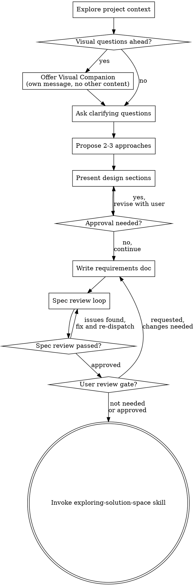

# Brainstorming Ideas Into Designs

Help turn ideas into fully formed designs and specs through natural collaborative dialogue.

In this repository, `brainstorming` is a child skill of `using-openharness`.
It does not define task roots or package structure. It only helps converge the design content that belongs in the active harness task package.

Start by understanding the current project context, then ask questions only when they are needed to reduce meaningful ambiguity. Once you understand what you're building, present the design clearly enough to proceed without forcing an approval pause unless the user asked for one or the remaining uncertainty is high risk.

<HARD-GATE>
Do NOT invoke any implementation skill, write any code, scaffold any project, or take any implementation action until the design is explicit enough to be written into the package and withstand review. User approval is required only when the user explicitly asks for a review gate or when unresolved ambiguity makes autonomous continuation risky.
</HARD-GATE>

## Anti-Pattern: "This Is Too Simple To Need A Design"

Every project goes through this process. A todo list, a single-function utility, a config change — all of them. "Simple" projects are where unexamined assumptions cause the most wasted work. The design can be short (a few sentences for truly simple projects), but it still needs to be made explicit before execution. Do not turn that requirement into unnecessary waiting.

## Checklist

You MUST create a task for each of these items and complete them in order:

1. **Explore project context** — check files, docs, recent commits
2. **Offer visual companion** (if topic will involve visual questions) — this is its own message, not combined with a clarifying question. See the Visual Companion section below.
3. **Ask clarifying questions only when needed** — one at a time, understand purpose/constraints/success criteria when the repo and user request do not already make them clear
4. **Propose 2-3 approaches** — with trade-offs and your recommendation
5. **Present design** — in sections scaled to their complexity; pause for approval only if the user asked for review checkpoints or if ambiguity remains high risk
6. **Write requirements doc** — write the validated requirements into `01-requirements.md` in the active harness package and update `02` / `03` only when already justified
7. **Spec review loop** — dispatch spec-document-reviewer subagent with precisely crafted review context (never your session history); fix issues and re-dispatch until approved (max 3 iterations, then surface to human)
8. **Optional user review gate** — use only when the user explicitly wants to review the written spec before proceeding or when unresolved ambiguity is too risky to carry forward autonomously
9. **Transition to exploration** — invoke `exploring-solution-space` before architecture and detailed design are finalized

## Process Flow

**The terminal state is invoking `exploring-solution-space`.** Brainstorming finishes when requirements are clear enough for exploration and design synthesis.

## The Process

**Understanding the idea:**

- Check out the current project state first (files, docs, recent commits)
- Before asking detailed questions, assess scope: if the request describes multiple independent subsystems (e.g., "build a platform with chat, file storage, billing, and analytics"), flag this immediately. Don't spend questions refining details of a project that needs to be decomposed first.
- If the project is too large for a single spec, help the user decompose into sub-projects: what are the independent pieces, how do they relate, what order should they be built? Then brainstorm the first sub-project through the normal design flow. Each sub-project gets its own spec → plan → implementation cycle.
- For appropriately-scoped projects, ask questions one at a time only when the repository and user request do not already resolve the point
- Prefer multiple choice questions when possible, but open-ended is fine too
- Only one question per message - if a topic needs more exploration, break it into multiple questions
- Focus on understanding: purpose, constraints, success criteria

**Exploring approaches:**

- Propose 2-3 different approaches with trade-offs
- Present options conversationally with your recommendation and reasoning
- Lead with your recommended option and explain why

**Presenting the design:**

- Once you believe you understand what you're building, present the design
- Scale each section to its complexity: a few sentences if straightforward, up to 200-300 words if nuanced
- Ask after each section only when the user asked for iterative review or when a wrong assumption would materially change the path
- Cover: architecture, components, data flow, error handling, testing
- Be ready to go back and clarify if something doesn't make sense

**Design for isolation and clarity:**

- Break the system into smaller units that each have one clear purpose, communicate through well-defined interfaces, and can be understood and tested independently
- For each unit, you should be able to answer: what does it do, how do you use it, and what does it depend on?
- Can someone understand what a unit does without reading its internals? Can you change the internals without breaking consumers? If not, the boundaries need work.
- Smaller, well-bounded units are also easier for you to work with - you reason better about code you can hold in context at once, and your edits are more reliable when files are focused. When a file grows large, that's often a signal that it's doing too much.

**Working in existing codebases:**

- Explore the current structure before proposing changes. Follow existing patterns.
- Where existing code has problems that affect the work (e.g., a file that's grown too large, unclear boundaries, tangled responsibilities), include targeted improvements as part of the design - the way a good developer improves code they're working in.
- Don't propose unrelated refactoring. Stay focused on what serves the current goal.

## After the Design

**Documentation:**

- Write the validated design into the active harness task package under `docs/designs/<task>/`:
  - update `01-requirements.md` when the validated design changes goals, scope, constraints, non-goals, or done criteria
  - update `02-overview-design.md` when the validated design changes architecture, boundaries, responsibilities, or primary flows
  - update `03-detailed-design.md` when the validated design changes implementation landing points, file-level structure, interfaces, or migration details
  - do not force all three files to grow on every task; update the relevant package docs for the design you actually validated
  - if no package exists yet, scaffold one first via the harness workflow, then write into that package
- Use elements-of-style:writing-clearly-and-concisely skill if available
- Commit the design document to git

**Spec Review Loop:**
After writing the spec document:

1. Dispatch spec-document-reviewer subagent (see references/spec-document-reviewer-prompt.md)
2. If Issues Found: fix, re-dispatch, repeat until Approved
3. If loop exceeds 3 iterations, surface to human for guidance

**User Review Gate:**
After the spec review loop passes, continue automatically by default.

Only stop for user review if one of these is true:
- the user explicitly asked to approve the spec before moving on
- unresolved ambiguity would make the next step high risk
- the change affects product direction enough that silent continuation would be unreasonable

When a review gate is needed, say:

> "Task package updated at `<path>`. Please review it before I continue into exploration and detailed design."

If the user requests changes, make them and re-run the spec review loop. Otherwise proceed without creating an unnecessary pause.

**Implementation:**

- Invoke `exploring-solution-space` after `01-requirements.md` is updated
- Do not skip directly to implementation after a completed brainstorming pass

## Key Principles

- **One question at a time** - Don't overwhelm with multiple questions
- **Multiple choice preferred** - Easier to answer than open-ended when possible
- **YAGNI ruthlessly** - Remove unnecessary features from all designs
- **Explore alternatives** - Always propose 2-3 approaches before settling
- **Incremental validation** - Make the design explicit before moving on, but do not create unnecessary approval pauses
- **Be flexible** - Go back and clarify when something doesn't make sense

## Visual Companion

A browser-based companion for showing mockups, diagrams, and visual options during brainstorming. Available as a tool — not a mode. Accepting the companion means it's available for questions that benefit from visual treatment; it does NOT mean every question goes through the browser.

**Offering the companion:** When you anticipate that upcoming questions will involve visual content (mockups, layouts, diagrams), offer it once for consent:
> "Some of what we're working on might be easier to explain if I can show it to you in a web browser. I can put together mockups, diagrams, comparisons, and other visuals as we go. This feature is still new and can be token-intensive. Want to try it? (Requires opening a local URL)"

**This offer MUST be its own message.** Do not combine it with clarifying questions, context summaries, or any other content. The message should contain ONLY the offer above and nothing else. Wait for the user's response before continuing. If they decline, proceed with text-only brainstorming.

**Per-question decision:** Even after the user accepts, decide FOR EACH QUESTION whether to use the browser or the terminal. The test: **would the user understand this better by seeing it than reading it?**

- **Use the browser** for content that IS visual — mockups, wireframes, layout comparisons, architecture diagrams, side-by-side visual designs
- **Use the terminal** for content that is text — requirements questions, conceptual choices, tradeoff lists, A/B/C/D text options, scope decisions

A question about a UI topic is not automatically a visual question. "What does personality mean in this context?" is a conceptual question — use the terminal. "Which wizard layout works better?" is a visual question — use the browser.

If they agree to the companion, read the detailed guide before proceeding:
`skills/brainstorming/references/visual-companion.md`
